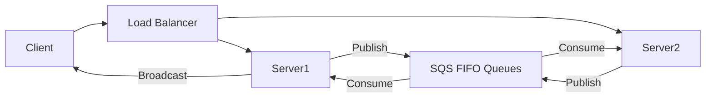

# ChatFlow - Scalable Distributed Chat System

**ChatFlow** is a high-performance, distributed chat system designed to handle high concurrency and massive message throughput. This project demonstrates a scalable architecture using WebSocket for real-time communication, AWS SQS for message distribution, and a partitioned database for persistence. Built as a part of the course CS6650 - Building Scalable Distributed Systems

## 🏗️ Architecture Overview

The system has evolved from a simple client-server model (v1) to a robust distributed architecture (v2).

**Key Components:**
*   **Load Balancer (AWS ALB)**: Distributes WebSocket connections across multiple server instances using sticky sessions.
*   **Server Nodes (EC2)**: Stateless Java servers that handle WebSocket connections and publish messages to queues.
*   **Message Broker (AWS SQS)**: FIFO queues ensure ordered delivery of messages within chat rooms.
*   **Database (Aurora PostgreSQL)**: Optimized schema for storing chat history and analytics.



## 📂 Project Structure

This repository contains several modules that make up the complete ecosystem:

### Core Modules
*   **`server-v2/`** 🌟
    The current, distributed version of the chat server. It implements the "fan-out" architecture using AWS SQS. This is the main application code.
*   **`client/`**
    A high-throughput WebSocket client used for load testing. It simulates thousands of concurrent users to stress-test the system.
*   **`database/`**
    Contains SQL schemas, setup scripts, and materialized view definitions for the PostgreSQL database backend.

### Infrastructure & Tools
*   **`deployment/`**
    Shell scripts and guides for deploying to AWS EC2, configuring the Application Load Balancer (ALB), and setting up SQS queues.
*   **`monitoring/`**
    Scripts to verify system health, monitor SQS queue depths in real-time, and track database performance metrics.
*   **`jmeter/`**
    Apache JMeter test plans for validating performance baselines and conducting heavy load tests.

### Legacy
*   **`server/`**
    The initial v1 implementation. Kept for reference to demonstrate the evolution from a monolithic to a distributed design.

## 🚀 Quick Start

### Prerequisites
*   Java 11+
*   Maven 3.6+
*   (Optional) AWS CLI for deployment

### Building the Project
Both the client and server modules are built using Maven.

```bash
# Build the main server
cd server-v2
mvn clean package

# Build the load test client
cd ../client
mvn clean package
```

### Running Locally (Single Node)
You can run a single instance of the v2 server locally for testing:

```bash
java -jar server-v2/target/chatflow-server-v2-2.0.0.jar
```
*The server will start on port 8080.*

For full deployment instructions, including how to set up the AWS infrastructure, please refer to the detailed guide in [server-v2/README.md](server-v2/README.md).